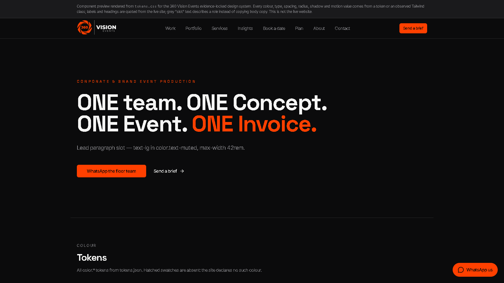
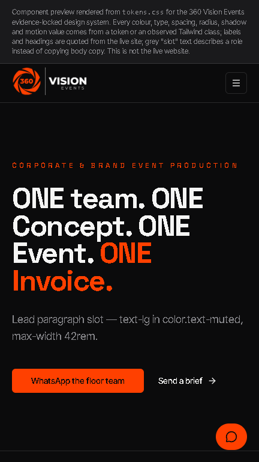
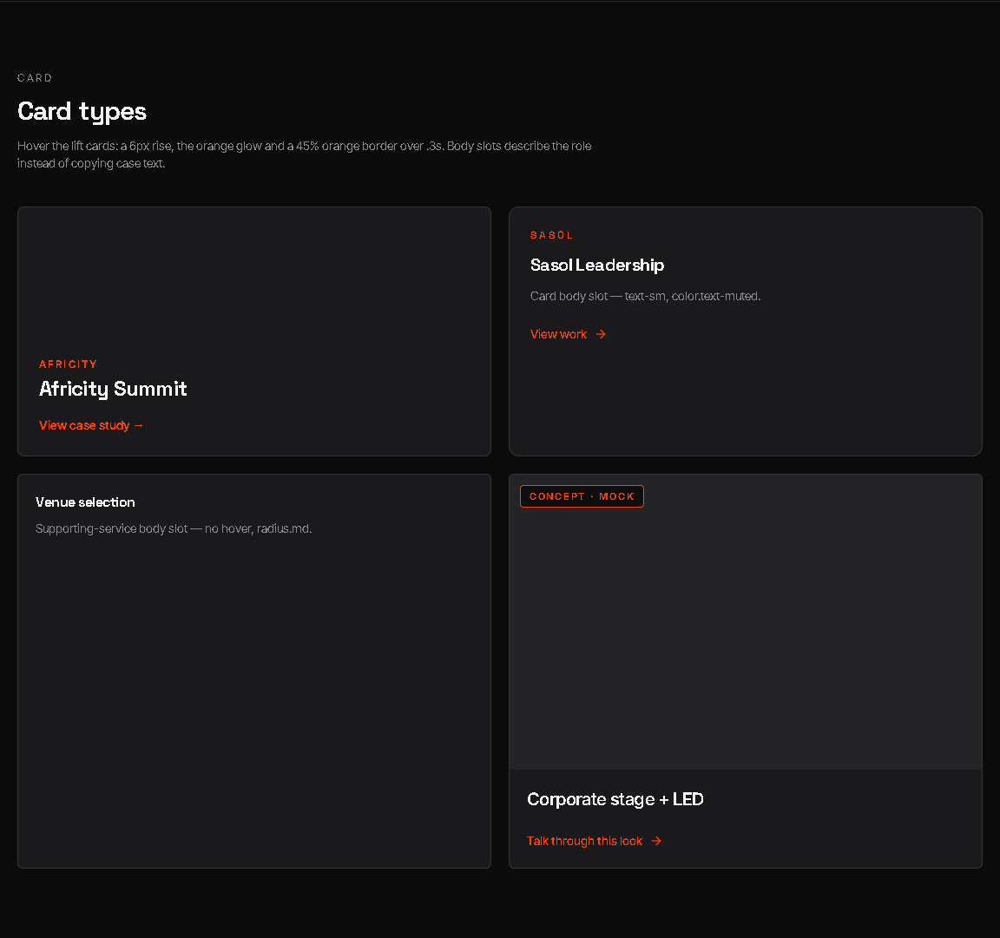
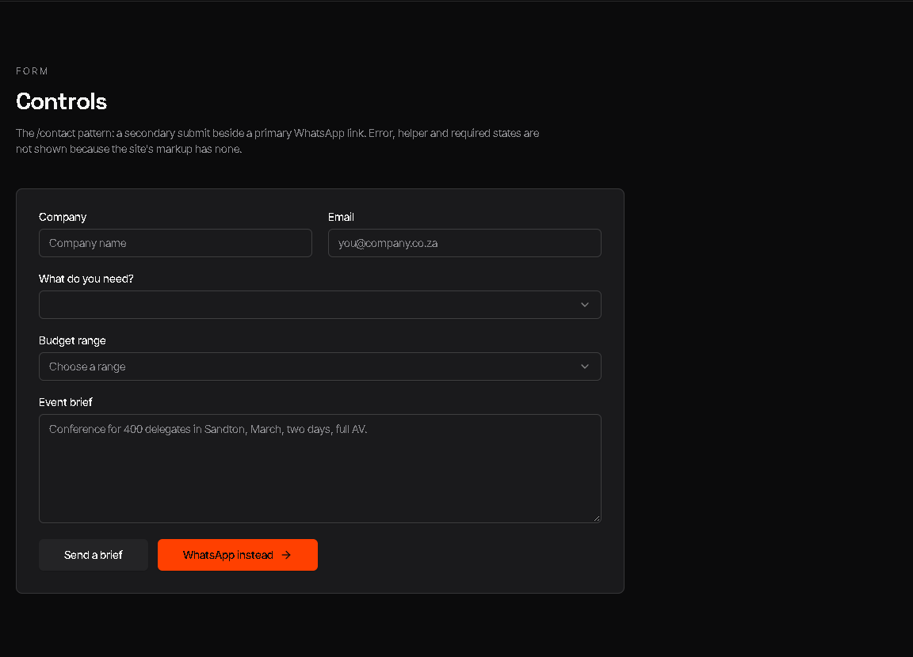
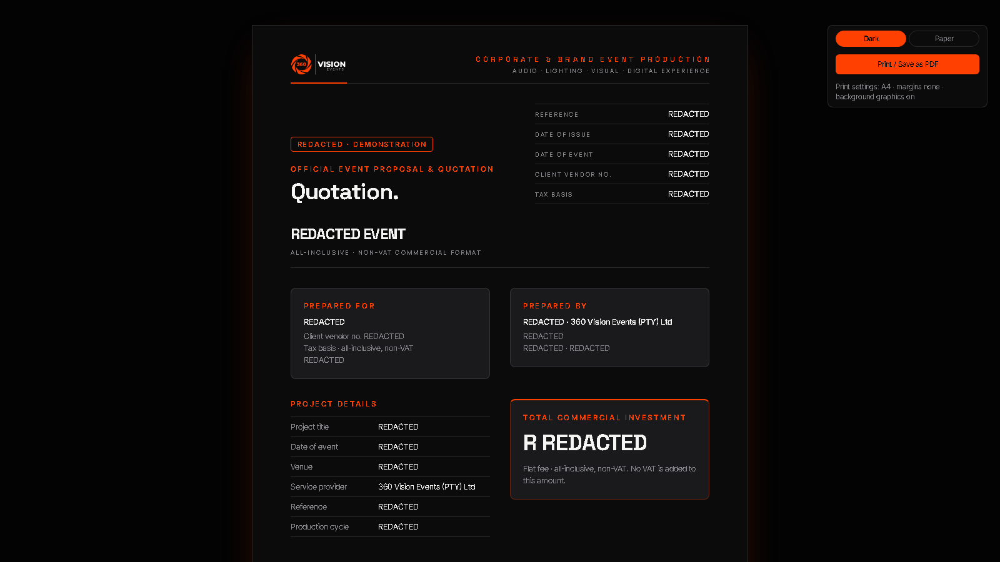
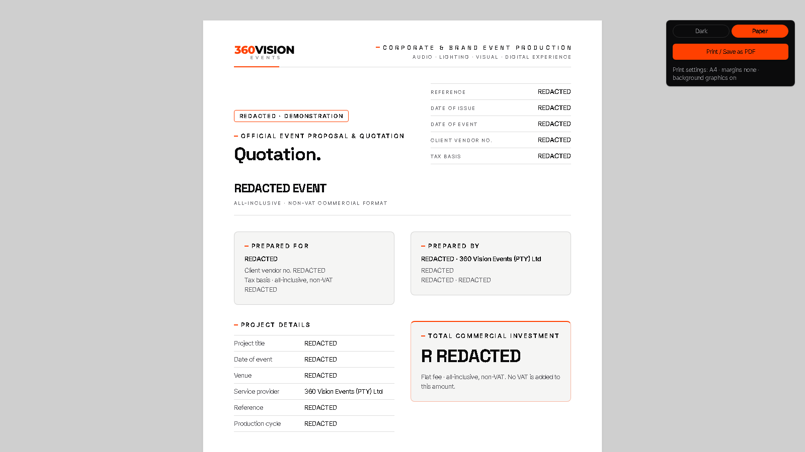
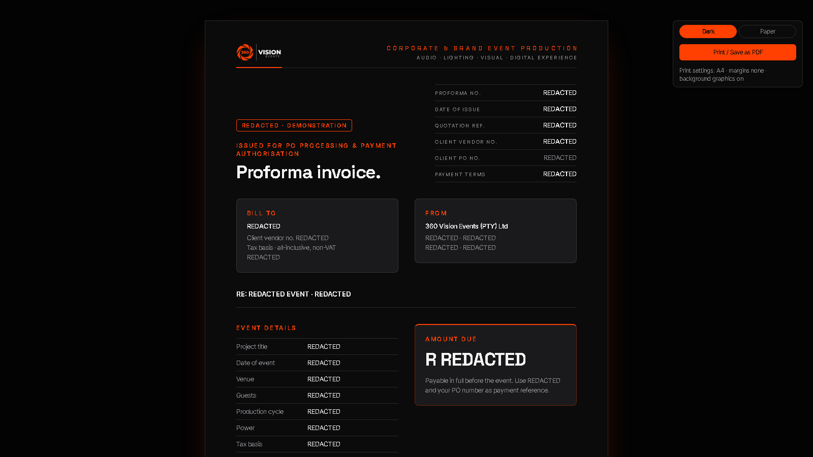
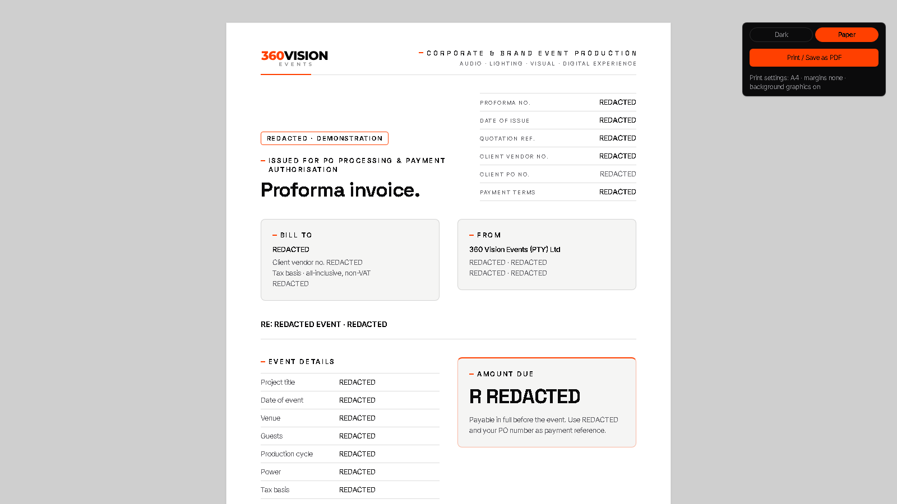

  <picture>
    <source
      media="(prefers-color-scheme: dark)"
      srcset="assets/brand/p03-primary-horizontal-divider-on-dark.png">
    <source
      media="(prefers-color-scheme: light)"
      srcset="assets/brand/p03-primary-horizontal-divider-on-light.svg">
    
  </picture>

<h1 align="center">360 Vision Events Design System</h1>

<strong>Observed on the site. Traceable to source. Ready for the work.</strong>

  
  
  
  
  
  

## Overview

The **360 Vision Events Design System** is a static, evidence-locked package for producing consistent 360 Vision Events interfaces, content and commercial documents. It turns the visual and verbal system observed across nine public website pages into **113 traceable design tokens**, documented component patterns, an official logo library, A4 quotation and proforma-invoice templates, and a packaged Claude skill.

It is built for:

- **Designers and frontend implementers** who need semantic CSS variables, DTCG-style JSON, component recipes and a Tailwind v4/shadcn adapter.
- **Brand and content teams** who need the observed production-floor voice, typography, colour and logo rules without invented brand decisions.
- **Commercial and operations teams** who need browser-based quotation and proforma templates with A4 print behaviour and calculated totals.
- **AI-assisted production workflows** that need a source-controlled skill with the same rules, assets and templates.

This repository is **not** the live website, an event-management platform, a client portal or a deployable application. Its value is narrower and more durable: one source for the brand rules that already exist, with every gap named instead of silently filled.

## Architecture

~~~mermaid
flowchart TD
    Site["Live public site 9 SSR pages, compiled CSS, logo and favicon"]
    Captures["Ephemeral raw captures session scratchpad — not versioned"]
    Verify["Five extraction tracks plus adversarial verification"]
    Model["Evidence-locked source model 738 verified observations"]

    JSON["tokens.json 113 DTCG-style tokens"]
    CSS["tokens.css 113 matching custom properties"]
    Spec["DESIGN.md rules, components, voice and gaps"]
    Evidence["evidence.json provenance, decisions, QA and trace"]
    Preview["preview.html static component reference"]
    Theme["shadcn-theme.css Tailwind v4 adapter"]
    Logos["Observed assets and official 2026 logo pack"]
    Templates["A4 quotation and proforma templates"]
    Skill["Claude skill source"]
    Dist["dist/*.skill prebuilt Claude package"]

    Site -. historical GET-only extraction .-> Captures
    Captures --> Verify --> Model
    Model --> JSON
    Model --> CSS
    Model --> Spec
    Model --> Evidence
    CSS --> Preview
    CSS --> Templates
    Logos --> Templates
    JSON --> Skill
    CSS --> Skill
    Spec --> Skill
    Preview --> Skill
    Theme --> Skill
    Logos --> Skill
    Templates --> Skill
    Skill --> Dist
~~~

The repository stores the outputs of an offline extraction and verification pipeline. A single observed source model produced matching JSON and CSS tokens, the human specification, the evidence trail and the component preview; the token files and brand assets then feed the document templates and Claude skill.

The raw captures and generator are not versioned, so the package is auditable through [`evidence.json`](design-system/evidence.json) but cannot currently regenerate itself. Decisions D01–D30—including the redirect, observed/absent token model, POPIA minimisation, logo provenance and line-ending policy—are summarised in [`.index/key-decisions.md`](.index/key-decisions.md).

## Tech Stack

| Category | Technology | Version / repository status |
|---|---|---|
| Languages and formats | HTML5, CSS, vanilla JavaScript, JSON, Markdown, PNG and SVG | Static files; no compiled application |
| Design tokens | CSS Custom Properties + DTCG-style JSON | 113 tokens: 110 observed, 3 explicitly absent |
| Evidence model | `360ve-design-evidence/1.0` | 738 observations, 113 token traces and decisions D01–D30 |
| UI reference | Static [`preview.html`](design-system/preview.html) | Links `tokens.css`; no frontend runtime |
| Commercial documents | Semantic HTML, shared CSS and dependency-free inline JavaScript | A4 quotation and proforma; line, group, VAT and grand-total calculations |
| Source-site vocabulary | Tailwind CSS **4.3.3** and shadcn-style component patterns | Observed in the source site's compiled CSS; not installed here |
| Consumer integration | Tailwind v4 `@theme inline` adapter | [`shadcn-theme.css`](skill/360-vision-events-design-system/assets/shadcn-theme.css); convenience mapping, not an observed site artefact |
| Typography | Inter 400–700, Space Grotesk 500/700, Inter Tight 400–600 | Loaded from the site's Google Fonts request; no vendored font files |
| Distribution | Claude skill source + ZIP-compatible `.skill` archive | Prebuilt under [`dist/`](dist/) |
| Local infrastructure | Python standard-library `http.server` | Optional preview server only; Python is not a package dependency |
| Data and storage | `tokens.json` and `evidence.json` | No database, API, authentication, cache or server state |
| Testing and QA | Seven recorded acceptance criteria, independent audit and re-audit | Historical checks pass; no checked-in test runner or CI workflow |

There is no package manifest, lockfile, Dockerfile or required environment file. Tailwind is a source-site fact and consumer target—not a runtime dependency of this repository.

## Key Features

- **113 traceable tokens.** [`tokens.json`](design-system/tokens.json) and [`tokens.css`](design-system/tokens.css) mirror one another one-for-one across colour, typography, spacing, layout, breakpoints, layering, blur, radius, shadows, gradients and motion.
- **Absence is modelled, not hidden.** `--color-success`, `--color-warning` and `--color-info` remain `initial`/`null` because the site does not define them. There is no invented light UI theme.
- **Auditable provenance.** [`evidence.json`](design-system/evidence.json) records the redirect chain, nine pages, 738 observations, decisions, corrections, QA and the source selector for every token.
- **Reusable component reference.** The preview covers swatches, type, spacing, buttons, cards, chips, form controls, CTA bands, navigation, footer and floating actions using tokens or observed classes.
- **Tailwind v4 and shadcn bridge.** The standalone adapter maps observed root variables to Tailwind v4 theme names while clearly labelling the adapter layer as a convenience.
- **Official logo guidance.** The 2026 pack distinguishes dark/light grounds, fully vector versus hybrid SVGs, file-specific orange variation and retained provenance.
- **A4 commercial-document workflow.** The quotation and proforma templates provide running print furniture, party panels, grouped line items, totals, VAT switching and dark/paper modes.
- **Claude-ready distribution.** The source skill carries brand rules, assets, references, templates and four evaluation prompts; `dist/` carries the ready-to-upload package.
- **Privacy-conscious public templates.** Shipped documents use explicit samples and bracketed placeholders. Filled HTML and PDFs are ignored repository-wide.
- **Voice as a working system.** Short full-stop headlines. Sentence-case imperatives. UK/South African spelling. Proof, not brochure filler.

## UI Walkthrough & Screenshots

Every image below is a real Chromium capture from the repository's loopback static server. Space Grotesk and Inter Tight were confirmed loaded before capture; the PNGs contain no EXIF or text metadata. The commercial-document states were filled at capture time with explicit **REDACTED** values and remain visibly labelled **Redacted · Demonstration**; no filled source file or private client data is stored in the repository.

### Component reference — desktop

The main reference surface establishes the system immediately: `--color-bg` on the canvas, `--color-text` and `--color-text-muted` for hierarchy, `--color-brand` used as a signal, and dark `--color-on-brand` text on orange. The display line uses `--font-family-display`; supporting copy uses `--font-family-body`. The 72rem content frame and 20px gutter come from `--size-container` and `--size-gutter`.

The page is documentation, not a production website. Labels explain component roles, and the top notice states that it is not the live site.

### Component reference — responsive state

At the captured 432×768 viewport the navigation collapses to the menu control, the hero stacks cleanly and there is no horizontal overflow. A narrower 360px audit found a 4px overflow in the spacing-scale documentation grid because [`preview.html:46`](design-system/preview.html#L46) reserves fixed `7rem` and `5rem` columns around the bar. That is a documentation-layout friction point, not a token defect.

### Card patterns

The crop shows four observed card families on `--color-surface` with `--color-border` hairlines and role-specific radii. Interactive cards use the `card-lift` pattern: a 6px rise, `--shadow-lift`, `--color-brand-border-hover` and `--motion-easing-smooth`. The concept treatment is explicitly labelled **CONCEPT · MOCK** so a render cannot be mistaken for completed work.

Usability note: the screenshot records resting states. Hover elevation is intentionally not frozen into the capture.

### Form controls

The form panel uses `--radius-lg`, `--color-surface`, `--color-input` boundaries and `--shadow-sm`. The secondary submit sits beside the primary WhatsApp action, matching the observed `/contact` hierarchy.

The gaps are important: no error, helper, required or success state was observed, so none is presented as approved brand behaviour. The specimen's 1px `--shadow-focus-ring` and low-contrast `--color-input` boundary also remain accessibility debt; the pseudo-selects at [`preview.html:342–343`](design-system/preview.html#L342) are visual references, not complete keyboard-operable comboboxes.

### Quotation — dark mode

The dark quotation uses the observed canvas and surface hierarchy, a restrained `--color-brand` rule, tokenised type and hairline borders. The complete template continues through the brief, service specification, grouped quotation schedule, computed totals and client-acceptance section.

All client, contact, venue and transaction-specific identity fields are redacted in this public capture, and all figures are explicitly illustrative. A real quotation must be created as an ignored `*.filled.html` copy and reviewed before it is sent.

### Quotation — paper mode

Paper mode is an ink-saving **proposal**, not an observed website light theme. It uses white paper, dark ink, a proposed `#5f5f64` muted value and orange only for rules, markers and large figures. Small orange text is avoided because `#ff4000` on white is only 3.5:1.

### Proforma invoice — dark mode

The matched proforma changes the workflow—not the visual grammar. It provides bill-to/from panels, the quotation reference, amount due, coverage and exclusions, grouped line items, totals, payment instructions and banking placeholders. Its dependency-free script formats values as South African rand and computes every total from `data-qty`, `data-rate` and `data-vat`.

### Proforma invoice — paper mode

The paper version preserves the same information architecture and switches to the ON-LIGHT P09 wordmark. Chrome or Edge is the supported PDF path because the repeated print header and footer rely on Chromium print behaviour.

The repository has no loading, empty, success or error application states to capture: it is a static reference package. Inventing those states would contradict the evidence-locked model.

## Walkthrough Video

No walkthrough video is currently committed.

A future demo should be a **60–90 second, 16:9** recording that moves through:

1. The component preview and token naming.
2. A token's path from UI role to `tokens.css`, `tokens.json` and `evidence.json`.
3. Dark and paper quotation/proforma modes.
4. Tailwind v4 integration and the packaged Claude skill.

Use a `--color-bg` canvas, restrained `--color-brand` lower-thirds, Space Grotesk titles and a male, neutral South African English voiceover. Publish captions and a transcript. Add a real thumbnail and stable embed only once the video exists—no placeholder media.

## Technical Debt & Risks

Remediation order follows real-world impact, starting with privacy and public reuse boundaries.

| Priority | Category | Observable risk | Evidence | Recommended action |
|---:|---|---|---|---|
| 1 | Security / POPIA | Current PNGs are sanitised, but older public Git objects and earlier `.skill` archives still contain the pre-redaction metadata categories. | [`TD-09`](.index/dead-code.md?plain=1#L17), [`D29`](.index/key-decisions.md?plain=1#L26) | Owner decision: accept the historic exposure or plan a repository-history rewrite and host-side cache/ref cleanup. Never force-push as a routine docs change. |
| 2 | Licensing / brand rights | No `LICENSE`, `NOTICE`, version or changelog exists despite a public repository containing official marks. | [`TD-08`](.index/dead-code.md?plain=1#L16) | Choose explicit terms for code/docs/templates and a separate proprietary asset/trademark notice before inviting reuse. |
| 3 | Reproducibility | The generator, checks and original extraction inputs are not versioned. The outputs are auditable but cannot be regenerated from this checkout. | [`TD-01`](.index/dead-code.md?plain=1#L9), [inventory boundary](.index/file-inventory.md#not-in-this-repository) | Restore a sanitised generator under `tools/`; derive recoverable inputs from `evidence.json`; document a deterministic generation command. |
| 4 | Testing / maintainability | Five package copies are synchronised by hand. There is no CI, parity gate, link check, privacy scan or visual regression suite. | [`TD-04`](.index/dead-code.md?plain=1#L12), [copy constraint](.index/architecture.md#constraints) | Version token/parity/package/template/privacy checks and run them in CI on every pull request. |
| 5 | Brand consistency | The generated `DESIGN.md` lags later focus/contrast guidance; logo oranges vary; only P09 is fully vector; ON-DARK SVGs do not exist. | [`TD-07`](.index/dead-code.md?plain=1#L15), [logo gaps](design-system/assets/logo-pack-2026/README.md#svg-versions-svg) | Restore the generator, then obtain an owner-approved fully vector logo set instead of tracing or recolouring supplied marks. |
| 6 | Accessibility / UX | The observed 1px focus ring is weak on orange and disappears in forced colours; input edges are below 3:1; reduced-motion and approved form states are absent; the preview pseudo-selects are not functional widgets. | [contrast guidance](skill/360-vision-events-design-system/SKILL.md?plain=1#L54-L58), [focus guidance](skill/360-vision-events-design-system/SKILL.md?plain=1#L81), [`preview.html:66`](design-system/preview.html#L66), [`DESIGN.md` gaps](design-system/DESIGN.md#9-open-gaps) | Define accessible extensions as explicit proposals: offset focus, transparent outline fallback, stronger field boundary, reduced motion and complete validation states. |
| 7 | Token interoperability | `tokens.json` is DTCG-style, not strict DTCG: CSS strings, `null`, mixed-unit calculations and repeated values need adaptation in strict tooling. | [`TD-05`](.index/dead-code.md?plain=1#L13) | Generate a separate strict export with aliases while preserving the current evidence-first representation. |
| 8 | Performance / offline reliability | Preview and templates request three Google Font families. Some CSS-used weights are not requested, and the duplicated self-contained skill increases repository size. | [font gap](design-system/DESIGN.md#9-open-gaps), [package copies](.index/architecture.md#constraints) | Decide whether to vendor approved fonts, align requested weights, and keep duplication checks deterministic. |
| 9 | Observability / freshness | Runtime telemetry is not applicable, but there is no automated live-site drift check, release attestation or per-commit integrity report. | [static architecture](.index/architecture.md#overview), [`evidence.json`](design-system/evidence.json) | Add scheduled, GET-only drift detection and publish machine-readable validation results without collecting personal data. |

Do not treat the recorded definition of done as a live CI badge. It is strong historical provenance; the executable checker is absent.

## Impact on Organisations / Users

| Audience | Practical impact |
|---|---|
| 360 Vision Events | Website work, commercial documents and AI-assisted outputs can start from the same observed visual and verbal foundation instead of re-deriving the brand for every job. |
| Designers and developers | Semantic CSS variables, DTCG-style exchange data, component recipes and a Tailwind adapter reduce repeated reverse-engineering and make deviations reviewable. |
| Brand and content teams | Documented logo rules and production-floor voice reduce accidental rebranding, unsupported proof claims and inconsistent calls to action. |
| Commercial and operations teams | Matched quotation and proforma templates standardise structure and recalculate quantities, rates, VAT and totals from one set of data attributes. |
| Event clients | Proposals and billing documents can present a more consistent hierarchy and identity. This repository does not provide a client portal or operational workflow. |
| Privacy and compliance reviewers | Placeholder-first public templates and repository-wide ignore rules reduce accidental exposure of client, personal, banking and event information; human review remains mandatory. |
| Exhibitors | No exhibitor-specific interface, data model or workflow exists here. Any benefit is indirect through more consistent event material. |

## Getting Started

### Prerequisites

- Git.
- A modern desktop browser.
- Python 3 only if you want the local preview server.
- Chrome or Edge for reliable A4 PDF output from the commercial templates.

No Node install, package-manager install, Docker setup, `.env` file or environment variable is required.

### 1. Clone the repository

~~~bash
git clone https://github.com/AN3S-CREATE/360-vision-events-design-system.git
cd 360-vision-events-design-system
~~~

### 2. Run the component preview

~~~bash
python -m http.server 8765 --bind 127.0.0.1 --directory design-system
~~~

Open <http://127.0.0.1:8765/preview.html>. If `8765` is already occupied, use another loopback port in both the command and URL.

### 3. Consume the tokens in plain CSS

`tokens.css` defines font stacks but does not load font files. Load the site's request first, then the tokens:

~~~html
<link rel="stylesheet"
      href="https://fonts.googleapis.com/css2?family=Inter:wght@400;500;600;700&family=Space+Grotesk:wght@500;700&family=Inter+Tight:wght@400;500;600&display=swap">
<link rel="stylesheet" href="design-system/tokens.css">
~~~

~~~css
body {
  background: var(--color-bg);
  color: var(--color-text);
  font-family: var(--font-family-body);
}

.primary-action {
  background: var(--color-brand);
  color: var(--color-on-brand);
  border-radius: var(--radius-md);
}
~~~

### 4. Use the Tailwind v4 / shadcn adapter

Copy [`shadcn-theme.css`](skill/360-vision-events-design-system/assets/shadcn-theme.css) into the consuming project as `360-vision-events-theme.css`, then import it after Tailwind:

~~~css
@import "tailwindcss";
@import "./360-vision-events-theme.css";

@layer base {
  h1, h2, h3 {
    font-family: "Space Grotesk", "Helvetica Neue", sans-serif;
    letter-spacing: -.03em;
  }
}

.font-clean {
  font-family: Inter, system-ui, sans-serif;
}

.card-lift {
  transition: transform .3s, box-shadow .3s, border-color .3s;
  transition-timing-function: cubic-bezier(.22, 1, .36, 1);
}

.card-lift:hover {
  transform: translateY(-6px);
  box-shadow: var(--shadow-lift);
  border-color: color-mix(in oklab, var(--primary) 45%, transparent);
}
~~~

The adapter maps colours, radii and the body/display families. The base heading, `.font-clean` and `.card-lift` rules above reproduce observed site behaviour not included in the adapter.

### 5. Create a quotation or proforma invoice

1. Copy [`quotation.html`](design-system/templates/quotation.html) or [`proforma-invoice.html`](design-system/templates/proforma-invoice.html) to a filename ending in `.filled.html` beside the original.
2. Confirm the copy is ignored: `git check-ignore -v design-system/templates/<name>.filled.html`.
3. Replace every bracketed placeholder and remove the `Sample · Template` badge.
4. Set `data-vat="none"` or the required rate on the root `<html>` element.
5. Print from Chrome or Edge: A4, margins **None**, browser headers/footers **off**, background graphics **on**.

Add `?mode=paper` to use the proposed ink-saving print variant. Never overwrite the tracked templates with real client, personal, banking, pricing or event data.

### 6. Install the Claude skill

- **Claude Code:** copy `skill/360-vision-events-design-system/` into the relevant skills directory without `evals/`, or unpack [`dist/360-vision-events-design-system.skill`](dist/360-vision-events-design-system.skill).
- **Claude app:** upload the `.skill` file through Settings → Capabilities → Skills.

### Troubleshooting

| Symptom | Check |
|---|---|
| Preview is unstyled in the in-app browser from `file://` | Ordinary desktop browsers can open the file directly; use the loopback server above for embedded-browser viewing and consistent relative asset loading. |
| Fonts fall back to system faces | Confirm access to `fonts.googleapis.com` and `fonts.gstatic.com`; wait for `document.fonts.ready` before visual capture. |
| `--color-success`, `--color-warning` or `--color-info` resolves to `initial` | This is intentional. Those roles are recorded as absent, not broken. |
| Paper mode looks unlike the website | Correct: it is a documented print proposal, not a website light theme. |
| Repeated PDF header/footer is missing | Print through Chrome or Edge; Firefox and Safari are not the supported template path. |
| Filled file appears in `git status` | Rename it to `*.filled.html`, keep it under `filled/`, or move it outside the public checkout; verify with `git check-ignore -v`. |

## Contributing

There is no standalone `CONTRIBUTING.md`, pull-request template or Conventional Commits policy yet. Until those are added, use these repository rules:

1. Read [`.index/README.md`](.index/README.md), [`.index/file-inventory.md`](.index/file-inventory.md), [`.index/architecture.md`](.index/architecture.md) and the relevant [`DESIGN.md`](design-system/DESIGN.md) section before changing files.
2. Treat observed evidence as the source of truth. Every new token needs an explicit `observed`, `inferred` or `absent` mode and supporting observation IDs. Observed tokens also require a source URL and selector; absent tokens keep their selector and observations without an invented value or source URL.
3. Keep `tokens.json` and `tokens.css` one-for-one. Update `DESIGN.md`, `evidence.json`, the skill copies and the packaged `.skill` in the same change.
4. Style token-first: use `var(--color-brand)`, `var(--font-family-display)`, `var(--space-4)`, `var(--radius-md)` and `var(--shadow-lift)`. Do not add unexplained raw colours, fonts, spacing or shadows.
5. Do not invent a light application theme, semantic status colours, form states or logo variants. Propose the extension in this repository with evidence and label it as a new decision.
6. Every UI/UX change must include a real updated screenshot, useful alt text and a link to the `DESIGN.md` rule or evidence decision it follows.
7. Scan text and binary metadata before committing. Never commit a filled commercial document or real client, personal, banking, registration, pricing, venue or event information.
8. Preserve the LF and binary policy in [`.gitattributes`](.gitattributes).
9. Update `.index/file-inventory.md` after every file change and record meaningful refreshes in `.index/context-refresh-log.md`.
10. In a pull request, state the source evidence, affected token/component paths, every synchronised copy and the verification performed. Bug reports need reproduction evidence; documentation corrections need the source they reconcile.

Consumers should propose new brand tokens **upstream in this repository** before hard-coding them downstream. A missing token is not permission to invent one.

## License

No `LICENSE` or `NOTICE` file is currently present. The repository therefore has **no declared reuse licence**; public visibility should not be read as an owner-approved permission to copy, modify or redistribute its contents.

Recommended next step: after owner/legal review, consider the [Apache License 2.0](https://www.apache.org/licenses/LICENSE-2.0) for source code, templates and documentation, paired with a separate asset/trademark notice. The **360 Vision Events name, logos and other brand assets should remain outside the code licence** unless the brand owner expressly chooses otherwise.

Until those files are added, the badge at the top intentionally says **license: not specified**.
